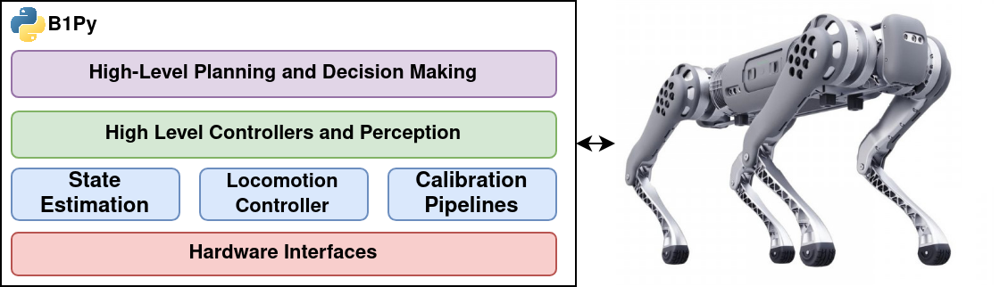

# B1Py
This repository hosts tools, documentations, example controllers, and state estimators for the Unitree B1 robot. Rather than focusing on a cutting-edge locomotion stack, this repository aims to bring simplicity by providing modular and reusable building blocks developed in Python. However, we do not stop here. Python Interfaces to advanced state estimators and controllers are also available for more serious use cases. 



<!-- The communication to the robot is made possible through the 'unitree_legged_sdk' and is carried out over the UDP link to the robot's onboard computer. High-level interface commands B1's onboard locomotion controller (running on the onboard intel computer with IP: `192.168.123.220`) and the low-level interface directly communicates with the onboard data acquisition micro controller (with IP: `192.168.123.110`). -->

## Installation
Simply install for your python interpreter of interest using pip:

```bash
git clone https://github.com/Rooholla-KhorramBakht/B1Py.git 
cd B1Py
<path/to/python> -m pip install .
```

## Getting Started
The following point to the documentations and Jupyter notebook examples for various use cases and procedures:
### Setup and Calibration
- [Getting Started with the Robot]()
- [Network Setup and Internet Sharing]()
- [NTP Time Synchronization Between the Onboard Computers]()
- [Vicon Communication Trough ROS](notebooks/vicon_through_ros.ipynb)
- [Intel Realsense Trough ROS]()
- [Intel Realsense Trough Python (librealsense2)]()
- [Python Interface with the Unitree's Controller (High-Level)](notebooks/unitree_locomotion_controller_interface.ipynb)
- [Python Interface with the Robot's Joint Controllers (Low-Level)]()
- [Camera Intrinsic Calibration (Kalibr)]()
- [Camera-IMU Calibration (Kalibr)]()
- [Camera Extrinsic Calibration (Vicon)]()
- [IMU-Vicon Calibration and Ground-Truth Generation]()
- [Calibration Results Aggregation and `B1Params` Class]()
- [Simulation using Pybullet]()
- [Simulation using NVIDIA Isaac Sim](docs/ISAACSIM.md)

### Control
- [Joystick with the Unitree High-Level Controller](notebooks/unitree_highlevel_joystick_control.ipynb)
- [Position Control with Unitree's Locomotion Controller and Vicon](notebooks/unitree_highlevel_position_control_vicon.ipynb)
- [Position Control with Unitree's Locomotion Controller and VIO/LiDAR]()
- [Unitree Locomotion Controller and CBFQP Obstacle Avoidance]()

#### Learning Based
- [Training an ActuatorNet for the Robot]()
- [Walk These Ways: Tuning Robot Control for Generalization with Multiplicity of Behavior]()
#### Linear MPC
ToDo
#### Nonlinear MPC
ToDo
### State Estimation
- [Ground Reaction Force Estimation]()
- [Contact Detection]()
- [Loosely Coupled Kinematics Inertial Fusion (EKF)]()
- [Loosely Coupled Kinematics Inertial Fusion (Factor-Graph)]()

