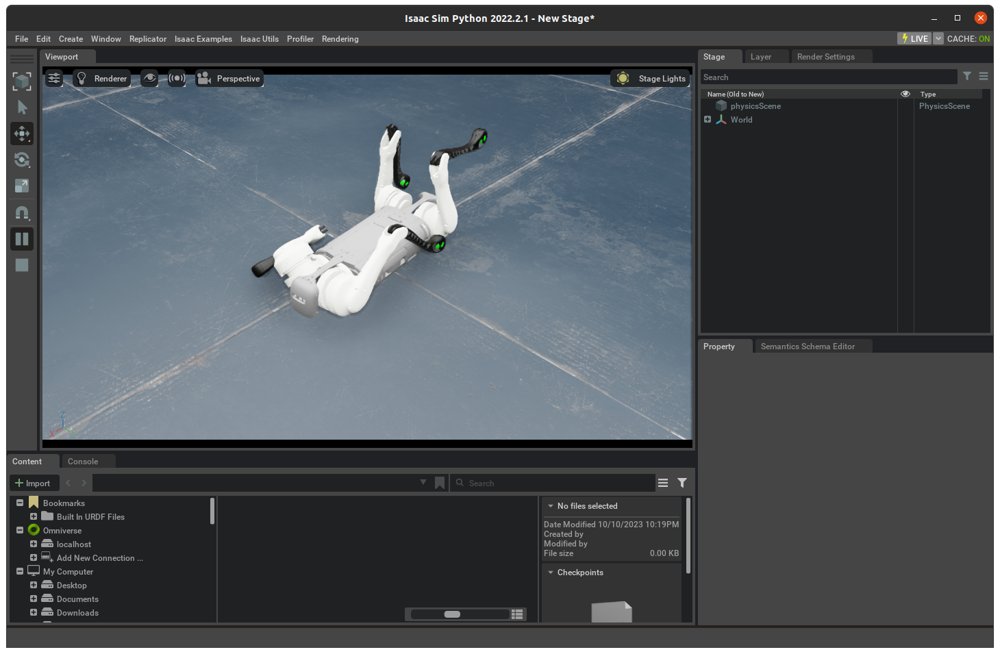

# Simulation Using Nvidia IsaacSim
## Standalone Simulator
This section assumes that the B1Py package is installed for the default python interpreter shipped with the Isaac simulator. Assuming that the Isaac simulator is located at `ISAAC_INSTALL_PATH`, install the B1Py as follows:

```bash
cd <path/to/B1Py>
${ISAAC_INSTALL_PATH}/python.sh -m pip install -e . 
```
### Low-Level Simulation
After installation, test the low-level simulator using the following demo:
```bash
cd <path/to/B1Py>
${ISAAC_INSTALL_PATH}/python.sh examples/isaacsim_standalone_lowlevel.py
```

The demo sends out random joint torques to the actuators and prints out the robot state:

